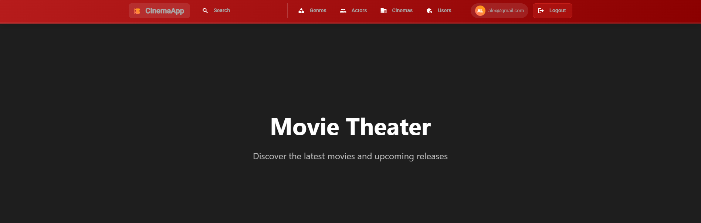
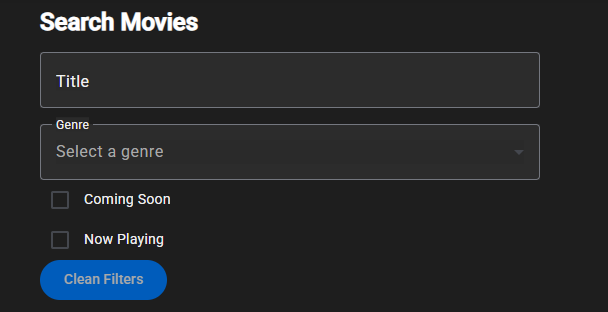
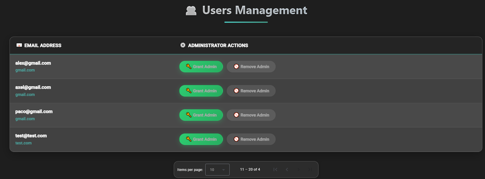
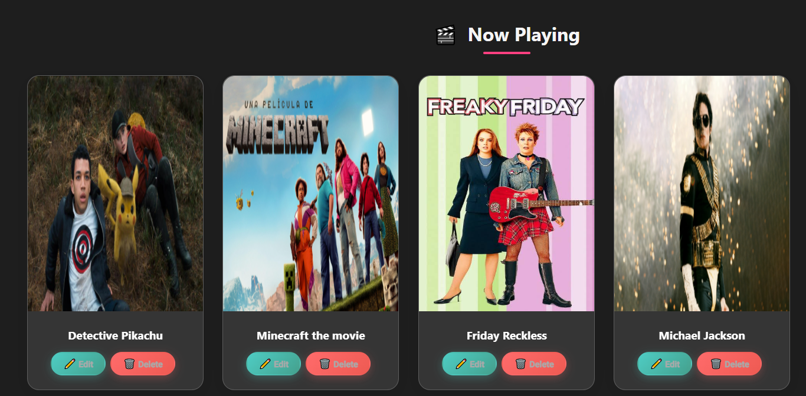

# 🎬 MoviesAngular - Frontend for Cinema Management System

> Angular-based frontend for a full-stack cinema platform.  
> **Live URL**: [https://portfolioacg.ddnsfree.com](https://portfolioacg.ddnsfree.com)  
> **Frontend Repo**: [https://github.com/Al148506/MoviesAngular](https://github.com/Al148506/MoviesAngular)  
> **Backend Repo**: [https://github.com/Al148506/MoviesAPI](https://github.com/Al148506/MoviesAPI)

---

## 📖 Appendix

- [Overview](#overview)
- [Screenshots](#screenshots)
- [Architecture](#architecture)
- [Features](#features)
- [UI Structure](#ui-structure)
- [Authentication & Authorization](#authentication--authorization)
- [Deployment](#deployment)
- [Technologies Used](#technologies-used)

---

## 🧩 Overview

**MoviesAngular** is the Angular frontend of the Movies full-stack application. It provides a responsive and interactive user interface that enables users to browse, filter, and view detailed movie data, while administrators can manage all aspects of the cinema system, such as creating movies, actors, genres, and more.

---
## 🖼️ Screenshots

### 🏠 Home Page


### 🔍 Search & Filters


### 👤 User Management


### 🎞️ Movies List


## 🏗️ Architecture

```text
[Browser]
   |
   v
[Angular Frontend] <--> [ASP.NET Web API Backend] <--> [SQL Server Database]
   |
   v
[Docker / Hosted @ portfolioacg.com]
```
##✨ Features
####👤 General Users

Browse currently available movies

Filter movies by title, genre, cinema, and release date

Search movies by keyword

View movie details with poster, summary, and cast

####🛠️ Administrators

Full CRUD operations via admin dashboard:

Movies

Actors

Genres

Cinemas

Users

Upload and manage movie posters

Drag-and-drop functionality for cast/genre selection

Forms with validation for entity management

Role-based access to admin tools

##🧱 UI Structure
Home Page – Featured movies carousel and navigation

Movies List – Pagination, filters, and search

Movie Detail – Poster, synopsis, cast, genre, trailer

Admin Panel – Management of all entities via forms and tables

Login/Register – Auth flow with JWT handling

NotFound Page – 404 redirection

##🔐 Authentication & Authorization
Auth handled with JWT tokens

Auth interceptor adds token to API requests

Route guards:

AuthGuard for authenticated users

AdminGuard for admin-only access

Role-based UI rendering (admin menus, forms, etc.)

##🚀 Deployment
Dockerized build using Angular CLI

Served with Nginx in production container

Hosted on custom domain: https://portfolioacg.com

CORS configured to communicate with ASP.NET Web API backend

Environment-based configuration for API URLs

##🛠️ Technologies Used
Frontend Framework: Angular 17

Styling: Bootstrap 5, SCSS

State Management: Services + Observables

Form Handling: Reactive Forms

Routing: Angular Router with Lazy Loading

Auth: JWT + LocalStorage + Route Guards

Build & Deploy: Docker, Nginx, Linux-based server


